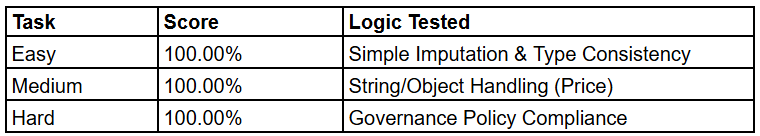
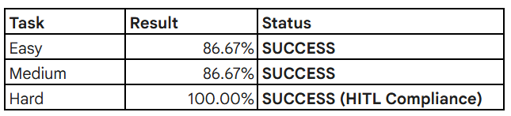

# **AutoClean-Pro: Hardware-Aware Data Governance**

## **Motivation**
In real-world AI pipelines, data cleaning consumes **80% of engineer time**. The RL environments currently are more focused on toy games; **AutoClean-Pro** evaluates if an AI agent can autonomously transform "raw, messy" data into "ML-ready" features while adhering to strict **Data Governance** standards.

Our environment tests an agent's ability to recognize when data is too "dirty" to fix and must be escalated to a human-simulating a high-stakes hardware-aware AI infrastructure.

## **Action & Observation Spaces**
### **Action Space (Discrete)**
The agent interacts with the data via a suite of specialized tools:
 1. ```fillna```: Constant value imputation
 2. ```knn_impute```: k-Nearest Neighbours (Hardware-intensive).
 3. ```mode_impute```: Categorical frequency imputation.
 4. ```cast_type```: Schema alignment (e.g., String to Float).
 5. ```drop_rows```: Limited data removal (Threshold: < 5% missing).
 6. ```flag_human```: The Governance Tool. Required when data integrity is compromised.
 7. ```finish```: Submits the final dataset for grading.

### **Observation Space (JSON)**
The agent receives a rich state representation:
 1. ```data_preview```: A 5-row window of the current dataframe (List of Records).
 2. ```missing_report```: Real-time dictionary of null counts per column.
 3. ```schema_info```:Current data types (e.g., float64, object).
 4. ```message```: Feedback from the environment regarding the last action's success.

## **Task Difficulties and Expected Behaviour**



## **Deterministic Grader Design**
Our environment utilizes a **Dual-Criteria Grader** to ensure scientific reproducibility:
 1. **Mathematical Fidelity**: Uses ```np.isclose``` with a 10^4 toleration to allow for floating point variance in KNN calculations.
 2. **Governance Alignment (Hard Task)**: In the "Hard" phase, the grader specifically targets to reward the **Policy Compliance**. If the agent attempts to "guess" (impute) a column with > 50% missing data instead of flagging it for a human, the score is penalized to 0.0.
## **System Architecture & Middleware**
AutoClean-Pro is engineered for **High-Availability** and **Interoperability**:
1. **CORS Middleware**: Enabled to allow cross-origin requests from remote AI agents and external monitoring dashboards.
2. **Request Logging**: Custom middleware tracks agent "Think Time" and ensures that the 15-step limit is strictly enforced at the API layer.
3. **Error Handling**: Global exception handlers prevent server crashes during "Multi-Mode" evaluation, ensuring the environment remains responsive even if an agent sends a malformed action.


## **Core Functionality and Logic**

1. **Governance Check (HITL Logic)**
Located in ```environment.py```, this function acts as an automated "gatekeeper". If an agent calls an imputation tool on a column with a high missing percentage, the environment rejects the action and returns a ```GOVERNANCE BLOCKED``` message, forcing the agent to rethink its strategy.

2. **Reward Shaping: The Dynamic Cirriculum Learning + Rarity Bonus**
AutoClean-Pro utilizes a non-binary reward function to provide a dense signal throughout the trajectory:
     $$Reward = \Delta Quality + RarityBonus - RepetitionPenalty$$
    1. ```Cleaning Gain```: Positive reward for reducing the total count of NaNs.
    2. ```Rarity Bonus```: A small incentive of $+0.05$ for utilizing diverse tools, preventing "tool-spamming.
    3. ```"Redundancy Penalty```: A negative reward of $-0.1$ if the agent tries to clean an already cleaned column.

3. **Baseline Inference (baseline.py)**
Uses **Zero-Shot Chain-of-Thought (CoT)**. The agent is prompted to:
    1. Scan the ```missing_report```.
    2. Check the ```schema_info```.
    3. Apply Governance Rules (Flag vs. Impute).
    4. Output a JSON action. 
        

## **Setup and Usage**
### **Local Installation**
#Install dependencies using uv (recommended)

uv sync
uv lock

### **Running the Environment Server**
#Start the OpenEnv-compliant FastAPI server

python -m server.app

### **Reproducing Baseline Scores**
The baseline uses a **Zero-Shot Chain-of-Thought** prompt to evaluate the data schema and apply governance rules.

python baseline.py

### **Target Baseline Results:**
 

## **Project Structure**
    ├── data/               # Dirty and Clean CSV pairs 
    ├── server/
    │   └── app.py          # FastAPI Entry Point (Port 7860)
    ├── environment.py      # Core RL Logic & Grader
    ├── models.py           # Pydantic V2 Schemas
    ├── baseline.py         # Reproducible Inference Script
    ├── pyproject.toml      # Project Metadata & Entry Points
    └── openenv.yaml        # OpenEnv Specification File


