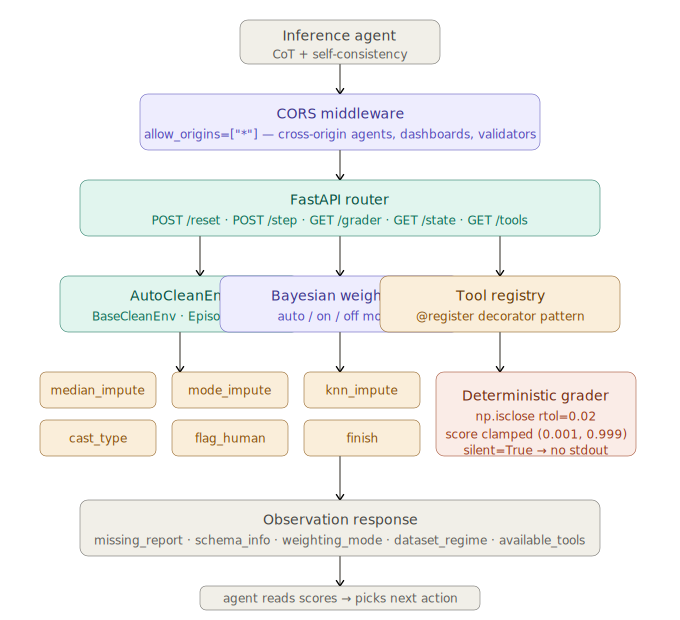

# AutoClean-Pro: Hardware-Aware Data Governance

**[Try the live API](https://himanshirawat0892-autoclean-pro.hf.space/docs)**

Data cleaning consumes 80% of ML engineer time. AutoClean-Pro is an OpenEnv RL environment where LLM agents learn to autonomously clean messy tabular datasets — deciding when to impute missing values statistically and when to escalate to a human reviewer under strict governance rules.

The key innovation is **Adaptive Bayesian Weighting**: missingness scores are amplified in scarce datasets (≤50 rows) where a single missing value carries disproportionate statistical risk — modelling real-world scenarios like rare disease registries, clinical trials, and sensor failure logs.

---

## How an Episode Works

1. `POST /reset?task_id=easy` — loads a dirty CSV and returns an observation
2. The agent reads `missing_report` (Bayesian-weighted missingness per column) and `schema_info`
3. `POST /step` — agent applies a cleaning tool to one column
4. Each step returns reward, updated observation, and done flag
5. `GET /grader` — deterministic score against ground-truth clean data

### Example: Easy Task

```
Observation after reset:
  missing_report: {"Age": 0.28, "Clicks": 0.14}
  weighting_mode: "bayesian_scarce"
  dataset_regime: "scarce_10rows"

Step 1: median_impute(Age)   → reward: +2.00  (score improves)
Step 2: median_impute(Clicks) → reward: +0.50  done=true
Grader: score=0.999  success=true
```

### Example: Hard Task (Governance)

```
Observation after reset:
  missing_report: {"Survey_Response": 0.42, "Income_k": 0.28}
  weighting_mode: "bayesian_scarce"

Survey_Response has 40% missing → agent MUST flag_human (not impute)
Any imputation attempt → penalty: -5.0 reward

Step 1: flag_human(Survey_Response) → reward: +2.00
Step 2: finish                       → done=true
Grader: score=0.999  success=true
```

---

## Adaptive Bayesian Weighting

The core technical innovation. Standard environments report flat missingness (1 missing / 10 rows = 10%). AutoClean-Pro amplifies scores for scarce datasets:

```
amplification = 1 + (threshold - n) / (threshold × 2)
  n=10, threshold=50 → amp = 1.40

weighted_pct = flat_pct × amplification
```

**Tool selection preserved across dataset sizes:**

| Missing / 10 rows | Flat % | Weighted % | Tool |
|---|---|---|---|
| 1 / 10 | 0.10 | 0.14 | `median_impute` |
| 2 / 10 | 0.20 | 0.28 | `knn_impute` |
| 3 / 10 | 0.30 | 0.42 | `flag_human` |

On a 1000-row dataset, 3 missing = 0.003 → `median_impute`. On a 10-row rare disease dataset, the same count escalates to human review. The amplification captures this real-world difference.

**Three configurable modes:**

| Mode | Behaviour |
|---|---|
| `auto` | Detects dataset size, applies amplification for n ≤ 50 |
| `on` | Always amplifies — for clinical / rare-event datasets |
| `off` | Flat proportion — standard behaviour for large datasets |

---

## Agent: Chain-of-Thought with Guided Self-Consistency

The inference agent uses **CoT with guided self-consistency** rather than a single greedy call:

1. Sample 3 LLM responses (temperature=0.0 for first, 0.3 for diversity)
2. Each response produces `<think>...</think>` reasoning + JSON action
3. Select the best action by: `urgency_score + 0.3 × consensus`
   - `urgency` = `missing_report[column]` from the environment
   - `consensus` = fraction of samples agreeing on (tool, column)

This prevents the most common failure mode — the LLM choosing a clean column when dirty ones remain — while using environmental signal (not majority vote alone) as the tie-breaker.

The system prompt is **built dynamically** from the observation, explaining to the LLM which weighting mode is active and what the amplified scores mean, so it can reason correctly about a score of `0.14` in scarce mode vs standard mode.

---

## Tool Registry

Tools self-register via decorator — the environment never hardcodes tool names:

```python
@ToolRegistry.register("median_impute")
def _median_impute(df, col, params):
    s = pd.to_numeric(df[col], errors="coerce")
    df.loc[:, col] = s.fillna(s.median())
    return df, f"Median impute on '{col}'."
```

New tools can be added without modifying `AutoCleanEnv`. The agent discovers available tools from `GET /tools` at runtime.

---

## Tasks

3 tasks across difficulty levels. All use real CSV data.

| Task | Dataset | Key challenge | Success threshold |
|---|---|---|---|
| `easy` | 10 rows, 2 numeric cols, 4 NaNs | Median impute both columns | score > 0.98 |
| `medium` | 10 rows, mixed types, 4 NaNs | Cast + median + mode impute | score > 0.98 |
| `hard` | 10 rows, 40% Survey_Response missing | Governance: must flag_human | score > 0.99 |

---

## Reward Shaping

```
Reward = ΔQuality + RarityBonus − RepetitionPenalty
```

| Component | Value |
|---|---|
| Cleaning gain (ΔQuality) | Proportional to NaNs removed, strategy-aligned bonus |
| flag_human on ≥35% column | +2.0 |
| Imputing a ≥35% column | −5.0 |
| Exact match with ground truth | +1.0 |
| Diverse tool usage | +0.1 |
| Back-to-back same tool | −2.0 |

Scores are clamped to (0.001, 0.999) — strictly open interval as required.

---

## Architecture


### BaseEnv Pattern

```python
class BaseCleanEnv(ABC):
    @abstractmethod
    def reset(self) -> Observation: ...
    @abstractmethod
    def step(self, action: Action) -> Dict: ...
    @abstractmethod
    def grader(self, silent: bool = False) -> float: ...
    @property
    @abstractmethod
    def state(self) -> EpisodeState: ...
```

`AutoCleanEnv` inherits `BaseCleanEnv`. Column names are discovered dynamically from the loaded CSV — nothing is hardcoded.

### EpisodeState

OpenEnv-compatible state contract with `episode_id` + `step_count`, plus Bayesian context:

```json
{
  "episode_id": "uuid",
  "step_count": 2,
  "weighting_mode": "bayesian_scarce",
  "dataset_regime": "scarce_10rows",
  "history": ["median_impute", "median_impute"]
}
```

---

## API Reference

| Endpoint | Method | Description |
|---|---|---|
| `/` | GET | Health check — returns 200 for validator |
| `/reset` | POST | Start episode. Params: `task_id`, `bayesian_mode`, `scarce_threshold` |
| `/step` | POST | Execute action: `{"tool": "...", "column": "...", "params": {}}` |
| `/grader` | GET | Deterministic score + weighting context |
| `/state` | GET | Full EpisodeState — OpenEnv compatible |
| `/tools` | GET | Live tool registry — agent can discover tools at runtime |
| `/baseline` | POST | Run `inference.py` in background; output in Logs tab |
| `/docs` | GET | Interactive Swagger UI |

---

## Setup and Running

```bash
# Install dependencies
uv sync

# Start the API server (port 7860)
uv run uvicorn server.app:app --host 0.0.0.0 --port 7860

# Run the inference agent
uv run python inference.py
```

### Expected inference output

```
[START] task=easy env=autoclean_benchmark model=Qwen/Qwen2.5-7B-Instruct
[STEP] step=1 action={"tool":"median_impute","column":"Age","params":{}} reward=2.00 done=false error=null
[STEP] step=2 action={"tool":"median_impute","column":"Clicks","params":{}} reward=0.50 done=true error=null
[END] success=true steps=2 rewards=2.00,0.50 score=0.9990

[START] task=medium ...
[END] success=true steps=3 rewards=... score=0.9990

[START] task=hard ...
[END] success=true steps=2 rewards=2.00,0.00 score=0.9990
```

---

## Project Structure

```
├── data/               # Dirty and clean CSV pairs (6 files)
├── server/
│   └── app.py          # FastAPI + Gradio UI (port 7860)
├── environment.py      # BaseCleanEnv + AutoCleanEnv + ToolRegistry
├── logic.py            # Adaptive Bayesian weighting + reward functions
├── models.py           # Pydantic V2 schemas (Action, Observation, State)
├── inference.py        # CoT + guided self-consistency agent
├── pyproject.toml      # Dependencies (uv)
└── openenv.yaml        # OpenEnv spec
```